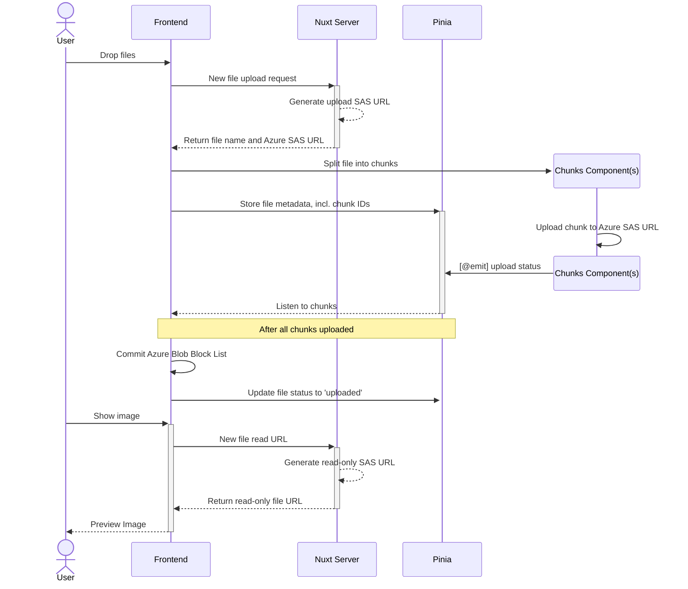
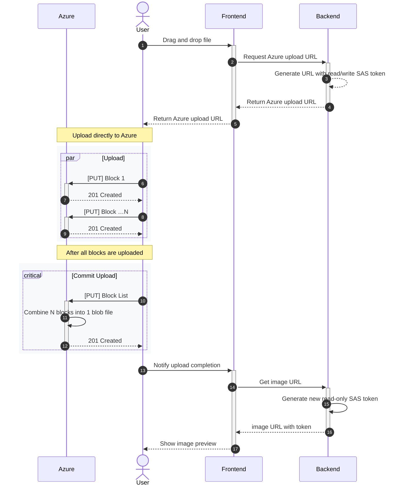

# Architecture

Note: "chunks" (generic) and "blocks" (Azure specific) are used interchangeably.

## Frontend Architecture

- SAS URLs/tokens always fetched from backend for security purposes, i.e. account access keys are never exposed to frontend
- **Frontend** (page or component): splits file(s) into chunks
- **Chunk Component**: might be empty UI, but tracks block upload progress
- **Pinia Store**: used to share data across Nuxt components and pages



## Cloud Architecture

### Security Features

- Files never touch our web servers.
- Blobs are default private, i.e. inaccessible.
- SAS tokens generated on demand for action specific (e.g. upload vs read) and temporary access, e.g. a few minutes.

> [!IMPORTANT]
> Although Azure recommends _against_ using service SAS tokens, it is not appropriate in this use case. In our Software as a Service (SaaS) scenario:
> - [Workload Identities](https://learn.microsoft.com/en-us/entra/identity/managed-identities-azure-resources/overview) do not apply because end-user uploads _directly_ to Azure for performance and resiliency advantages. 
> - [User delegation SAS](https://learn.microsoft.com/en-us/rest/api/storageservices/create-user-delegation-sas) do not apply because our SaaS application owns identity and access management domain and does _not_ use Entra ID as an identity provider. Additionally User SAS tokens also _cannot_ be revoked, a security disadvantage we want to avoid.
> 
> Therefore, **the architecture below is the _most secure_ cloud architecture for _this_ SaaS scenario**.

### Why upload directly to Azure?

* **Performance** - Avoid additional hops and latency when funnelling through app backend
* **Resilience** - Leverage Azure's built-in features to handle (retry-able) blocks and committing back into single blob file



## Realtime Updates

Workflow status updates stream from server → browser via Server-Sent Events (`GET /api/realtime/stream`), backed by an in-memory EventEmitter bus. The connection is authenticated by the user session.

### Known limitation: SSE on Vercel

SSE is a long-lived connection, which is a known mismatch with Vercel's serverless function model — function invocations are time-capped, so the stream gets killed and the client reconnects at intervals rather than holding one durable channel. It works, but the platform isn't shaped for this transport.

### Why we haven't migrated

The natural fix is Supabase Realtime (Postgres-change websockets). Doing it properly requires Row-Level Security policies on every table the browser subscribes to — otherwise the websocket becomes a back-door around the API's `requireAuthorization` checks.

That's significant, multi-phase work: designing RLS policies that match the household-isolation model, migrating the realtime client, and verifying behavioural parity with the current SSE flow. Intentionally **not prioritized for this POC**. Decision to revisit mid-to-late June 2026.

### Example Azure URLs

#### [PUT Block](https://learn.microsoft.com/en-us/rest/api/storageservices/put-block?tabs=microsoft-entra-id) 

- URL: `https://myaccount.blob.core.windows.net/mycontainer/myblob?comp=block&blockid=id` 
- Query Params:
  - `comp=block`
  - `blockid={id}`
  - `sv={token}`
#### [PUT Block List](https://learn.microsoft.com/en-us/rest/api/storageservices/put-block-list?tabs=microsoft-entra-id)

- URL: `https://myaccount.blob.core.windows.net/mycontainer/myblob?comp=blocklist`
  - Query Params:
  - `comp=blocklist` 
- Sample Request:

  ```
  Request Syntax:  
  PUT https://myaccount.blob.core.windows.net/mycontainer/myblob?comp=blocklist HTTP/1.1  
    
  Request Headers:  
  x-ms-date: Wed, 31 Aug 2011 00:17:43 GMT  
  x-ms-version: 2011-08-18  
  Content-Type: text/plain; charset=UTF-8  
  Authorization: SharedKey myaccount:DJ5QZSVONZ64vAhnN/wxcU+Pt5HQSLAiLITlAU76Lx8=  
  Content-Length: 133  
    
  Request Body:  
  <?xml version="1.0" encoding="utf-8"?>  
  <BlockList>  
    <Latest>AAAAAA==</Latest>  
    <Latest>AQAAAA==</Latest>  
    <Latest>AZAAAA==</Latest>  
  </BlockList>  
  ```

### PUT Blob Requests

Per [request headers docs](https://learn.microsoft.com/en-us/rest/api/storageservices/put-blob?tabs=microsoft-entra-id#request-headers-all-blob-types), these are the minimum headers we are setting:

| Header | Value |
|:--|:--|
| `Content-Type` | ?? Insomnia used `image/png`. Default is `application/octet-stream` |
| `Date` | [ISO-8601 Format](https://learn.microsoft.com/en-us/rest/api/storageservices/formatting-datetime-values), e.g. `YYYY-MM-DD` | 
| `Content-MD5` | Optional. But we should send it too. |
| `x-blob-type` | `BlockBlob` |
| `x-ms-tags` | query-string encoded tags on blob. |

Not required (for our scenario):

- `Authorization` - because token already in URLs
- `Content-Length` - not required for block blobs
- `x-ms-version` - not required, because we are not doing authorized request.

---

## References

#### General

- [Mozilla: 201 Status Code - Created](https://developer.mozilla.org/en-US/docs/Web/HTTP/Reference/Status/201)
- [Azure Docs: Understanding block blobs, append blobs, and page blobs](https://learn.microsoft.com/en-us/rest/api/storageservices/understanding-block-blobs--append-blobs--and-page-blobs)
- [Storage: Create a service SAS](https://learn.microsoft.com/en-us/rest/api/storageservices/create-service-sas) incl. params and permissions tables and how SAS generation works

#### Azure Blob Storage APIs

- Blob Service
  - [API Versions](https://learn.microsoft.com/en-us/rest/api/storageservices/versioning-for-the-azure-storage-services)
  - [Formatting Datetime Values](https://learn.microsoft.com/en-us/rest/api/storageservices/formatting-datetime-values)
  - [Service SaaS Permissions](https://learn.microsoft.com/en-us/rest/api/storageservices/create-service-sas#specify-permissions)

- [REST API](https://learn.microsoft.com/en-us/rest/api/storageservices/blob-service-rest-api)
  - [Request Headers](https://learn.microsoft.com/en-us/rest/api/storageservices/put-blob?tabs=microsoft-entra-id#request-headers-all-blob-types)
  - [Put Blob](https://learn.microsoft.com/en-us/rest/api/storageservices/put-blob?tabs=microsoft-entra-id)
  - [Put Block](https://learn.microsoft.com/en-us/rest/api/storageservices/put-block?tabs=microsoft-entra-id)
  - [Put Block List](https://learn.microsoft.com/en-us/rest/api/storageservices/put-block-list?tabs=microsoft-entra-id) to commit the blocks
