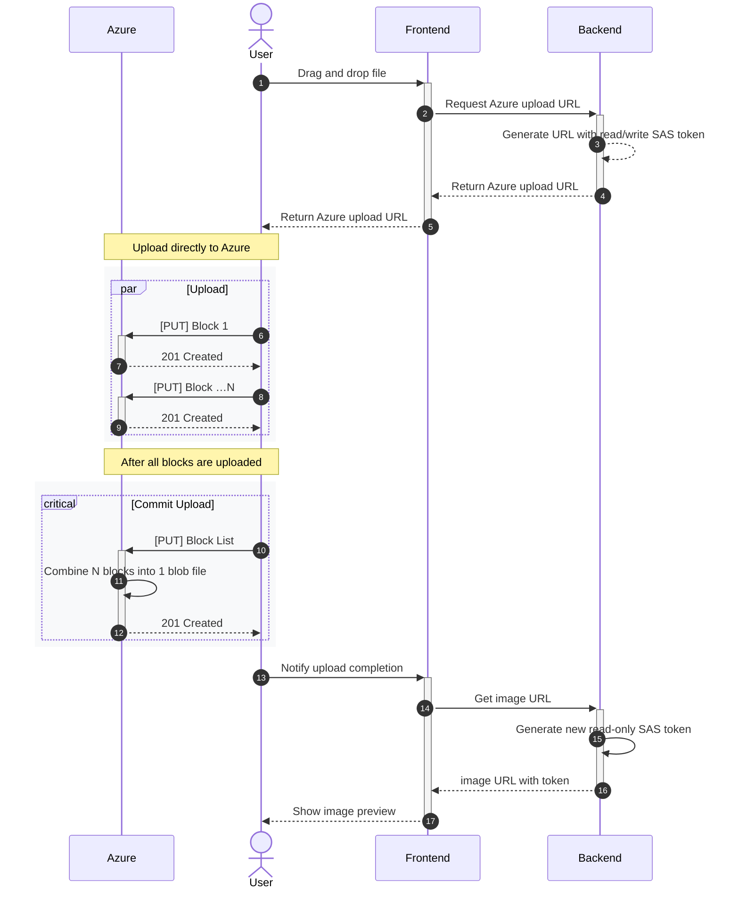

# Architecture

Note: "chunks" (generic) and "blocks" (Azure specific) are used interchangeably.

## Database

Two databases, split by purpose:

| Data | Engine | Infra provider |
|:--|:--|:--|
| Application data ) | Postgres | [Supabase](https://supabase.com/) |
| Static website content | SQLite | [Turso](https://turso.tech/) |

> [!NOTE]
> Content uses Turso (not Supabase) because [@nuxt/content](https://content.nuxt.com/)'s Postgres adapter needs the `pg` driver, which conflicts with the `postgres-js` driver Supabase's transaction pooler requires.

### Database Connections in Serverless 

Postgres expects long-lived connections but serverless is ephemeral and short-lived, which can quickly exhaust connections.

- Use Supabase's server-side pooler to maintain hot connections and share with short lived clients.
- Configure postgres to use `prepare: false` because pooler reuses connections and `PREPARE` and `EXECUTE` statements are not guaranteed to land on same session - biggest performance gain.
- Setting `max: 1` connections will create a bottleneck. We'll split the difference and use 5. 


_Diagram - "Supavisor" Connection Pooler (Source: Supabase)_

> [!NOTE]
> We are **not** using Fluid compute referenced in Vercel article. But some best practices still apply.

#### References

- [Supabase: Connecting via Transaction Mode](https://supabase.com/docs/guides/database/connecting-to-postgres#pooler-transaction-mode)
- [Vercel: Best Practices for Connection Pooling with Vercel Functions](https://vercel.com/kb/guide/connection-pooling-with-functions)

## Frontend Architecture

- SAS URLs/tokens always fetched from backend for security purposes, i.e. account access keys are never exposed to frontend
- **Frontend** (page or component): splits file(s) into chunks
- **Chunk Component**: might be empty UI, but tracks block upload progress
- **Pinia Store**: used to share data across Nuxt components and pages

### Owners and dumb leaves

Components are split by **role**, not preference. The role decides who fetches.

| | **Owner** (container) | **Leaf** (presentational) |
|:--|:--|:--|
| Owns | the data's lifecycle, URL/selection state | nothing — renders what it's given |
| Use for | route-level pages, widgets rendered once | components swapped or repeated by id |
| Fetch | `useAsyncData` in setup | none — the owner warms the store |

**Fetch at the level that owns the data's lifecycle; render at the leaves.**

The guiding constraint is the **remount flash**, not separation of concerns:

- A leaf that self-fetches on id-change empties itself between `idA` and `idB`.
- Its root `v-if="data"` goes falsy → the subtree unmounts and remounts → visible blink on every swap.
- The flash is about **identity**, not staleness, so reactivity cannot fix it.

> [!IMPORTANT]
> - A leaf rendering a **skeleton** instead of `v-if`-ing itself away never unmounts, so it never flashes.
> - This means "owner fetches" is a consequence of how our leaves are written, **not** a law. Skeleton-based leaves may self-fetch.
> - Whichever is chosen, a leaf's root must never be conditional.

**The reused-leaf trap.** A leaf inside a reused container (e.g. a tabbed panel where rows swap without remounting) keeps its instance while `props.id` changes:

- Store-getter `computed`s are safe — they re-evaluate automatically.
- A bare setup-time fetch runs **once**, for the first id only. Later swaps silently never re-fetch.
- When a reused leaf must self-fetch, key it off the id: `watch(() => props.id, fn, { immediate: true })`. `immediate` also covers cold load, where the id is born-set and never "changes".

### Reactivity in stores

Stores expose **getter factories**, not snapshots:

```js
const getExpenseById = computed(() => id => expenses.value[id])
```

- A leaf reading `store.getExpenseById(props.id)` inside its own `computed` re-renders on any change to that row — whether from a fetch, a local mutation, or a realtime push.
- Aliasing a store's ComputedRef to a local const breaks this (see [`rules/user-store.md`](.claude/rules/user-store.md)). Reference the store in templates and computeds.
- Stores never import each other. The page or composable composes across domains by warming each store by id.

**Forms are the deliberate exception.** A form copies store data into a local `ref` and then diverges from it — that copy is what makes cancel possible, and also what makes the form stop tracking the store. Reactivity reaches every read surface for free; it cannot reach an already-seeded form.

### Where validation lives

- Zod schemas in `shared/utils/zod-schemas/` are the single source of truth, used by both frontend and backend.
- **Stores** validate before sending to the backend.
- **Components** only surface and display errors — they do not validate or type-check.

This split exists to avoid duplicate validation logic that is hard to debug.

## Realtime Updates

Postgres triggers build a payload and publish to a per-resource topic; the browser subscribes read-only.

- One transport for all four tables — `expenses`, `receipts`, `uploads`, `workflow_runs`
- `realtime.store` imports **zero** stores. Domain stores register their own `ingest*` handler with it
- The browser **never** queries Postgres. All reads and writes go through the Nuxt API
- Authorization is the **topic join**, evaluated once by an RLS policy on `realtime.messages` — so the trigger's topic string is the entire boundary

### Previous iterations

- **Server-Sent Events** — abandoned: needs a long-lived connection, but Vercel functions are capped at minutes, so the stream died and reconnected instead of holding a durable channel
- **`postgres_changes` with RLS** — fine for `workflow_runs`, but it always sends the **whole row** and can't subscribe to a column subset. Too heavy for domains carrying composite `jsonb` (`uploads.ocr_json` runs to 100s of KB)

> [!IMPORTANT]
> Payloads are **snapshots, not diffs** — every listed scalar arrives at its current value, and `null` means "null in the DB right now".
> - A column missing from the payload never pushes, so the UI silently renders a stale value
> - Relations are never in a payload, so ingests **merge**, never replace
> - Endpoints return `receiptId`, not an embedded `receipt` — fetched and pushed rows must have the same shape

**Continue reading: [`docs/REALTIME.md`](docs/REALTIME.md)** — security design, JWT minting, policies, payload tiers and migrations.

## Cloud Architecture

### Security Features

- Files never touch our web servers.
- Blobs are default private, i.e. inaccessible.
- SAS tokens generated on demand for action specific (e.g. upload vs read) and temporary access, e.g. a few minutes.

> [!IMPORTANT]
> Although Azure recommends _against_ using service SAS tokens, it is not appropriate in this use case. In our Software as a Service (SaaS) scenario:
> - [Workload Identities](https://learn.microsoft.com/en-us/entra/identity/managed-identities-azure-resources/overview) do not apply because end-user uploads _directly_ to Azure for performance and resiliency advantages. 
> - [User delegation SAS](https://learn.microsoft.com/en-us/rest/api/storageservices/create-user-delegation-sas) do not apply because our SaaS application owns identity and access management domain and does _not_ use Entra ID as an identity provider. Additionally User SAS tokens also _cannot_ be revoked, a security disadvantage we want to avoid.
> 
> Therefore, **the architecture below is the _most secure_ cloud architecture for _this_ SaaS scenario**.

### Why upload directly to Azure?

* **Performance** - Avoid additional hops and latency when funnelling through app backend
* **Resilience** - Leverage Azure's built-in features to handle (retry-able) blocks and committing back into single blob file


```mermaid
sequenceDiagram
    autonumber
    participant Azure
    actor User
    participant Frontend
    participant Backend
    User->>+Frontend: Drag and drop file
    Frontend->>+Backend: Request Azure upload URL
    Backend-->>Backend: Generate URL with read/write SAS token
    Backend-->>-Frontend: Return Azure upload URL
    Frontend-->>-User: Return Azure upload URL
    note over User, Azure: Upload directly to Azure
    rect rgb(248, 249, 250)
        par Upload
            User->>+Azure: [PUT] Block 1
            Azure-->>-User: 201 Created
            User->>+Azure: [PUT] Block …N
            Azure-->>-User: 201 Created
        end
    end
    note over User, Azure: After all blocks are uploaded
    rect rgb(248, 249, 250)
        critical Commit Upload
            User->>+Azure: [PUT] Block List
            Azure->>Azure: Combine N blocks into 1 blob file
            Azure-->>-User: 201 Created
        end
    end
    User->>+Frontend: Notify upload completion
    Frontend->>+Backend: Get image URL
    Backend->>Backend: Generate new read-only SAS token
    Backend-->>-Frontend: image URL with token
    Frontend-->>-User: Show image preview
```

## Handling LLM Rate Limits

LLM calls route through the [Vercel AI Gateway](https://vercel.com/docs/ai-gateway) via the AI SDK. Rate-limit (429) backoff is delegated to the SDK's built-in retry, and the Gateway smooths per-provider TPM limits and can fail over between providers. Trigger.dev's task-level retry (`maxAttempts: 3` in `trigger.config.js`) still wraps each task as an outer safety net.

When retries are exhausted, the failure surfaces in the UI: the workflow run's `errors` JSON column gains an entry under the relevant step key (`adjustExpense`, `annotations`, etc.), the `workflow_runs` trigger broadcasts the change, and the failed-step indicator in the upload table shows the underlying error.

### Prior art: the Azure TPM problem (learnings)

Before the Gateway migration, calls hit an Azure OpenAI deployment with a fixed tokens-per-minute ceiling, and concurrent uploads blew past it. Each upload fires 3 LLM calls post-OCR (annotations ~5K tokens, normalize + adjust ~1.5K each), so a 5-file batch demanded ~45K tokens/minute against a 10K-TPM deployment — surfacing ~35 user-visible errors. A hand-rolled per-call retry loop fixed it, and its design choices are worth keeping as notes even though the Gateway/SDK now own this:

- **Checkpointed waits, not `setTimeout`.** Backoff used Trigger.dev's `wait.for`, which checkpoints the task and frees the worker during the wait — so retrying under rate limits didn't consume concurrency.
- **Jitter on `Retry-After`.** A 0–5s jitter was added on top of the server's `Retry-After` to break lockstep — otherwise several uploads that 429'd at the same instant would all retry at the same later instant and re-collide.
- **Layered resilience.** A cheap inner per-call retry (recovers within the TPM window) under a coarse outer task-level retry (survives a rolled-over window) — the inner layer absorbed almost everything before the outer one engaged.

The Gateway makes most of this unnecessary: provider-side smoothing plus fallback means a single deployment's TPM ceiling is no longer the hard wall it was.

### Example Azure URLs

#### [PUT Block](https://learn.microsoft.com/en-us/rest/api/storageservices/put-block?tabs=microsoft-entra-id) 

- URL: `https://myaccount.blob.core.windows.net/mycontainer/myblob?comp=block&blockid=id` 
- Query Params:
  - `comp=block`
  - `blockid={id}`
  - `sv={token}`
#### [PUT Block List](https://learn.microsoft.com/en-us/rest/api/storageservices/put-block-list?tabs=microsoft-entra-id)

- URL: `https://myaccount.blob.core.windows.net/mycontainer/myblob?comp=blocklist`
  - Query Params:
  - `comp=blocklist` 
- Sample Request:

  ```
  Request Syntax:  
  PUT https://myaccount.blob.core.windows.net/mycontainer/myblob?comp=blocklist HTTP/1.1  
    
  Request Headers:  
  x-ms-date: Wed, 31 Aug 2011 00:17:43 GMT  
  x-ms-version: 2011-08-18  
  Content-Type: text/plain; charset=UTF-8  
  Authorization: SharedKey myaccount:DJ5QZSVONZ64vAhnN/wxcU+Pt5HQSLAiLITlAU76Lx8=  
  Content-Length: 133  
    
  Request Body:  
  <?xml version="1.0" encoding="utf-8"?>  
  <BlockList>  
    <Latest>AAAAAA==</Latest>  
    <Latest>AQAAAA==</Latest>  
    <Latest>AZAAAA==</Latest>  
  </BlockList>  
  ```

### PUT Blob Requests

Per [request headers docs](https://learn.microsoft.com/en-us/rest/api/storageservices/put-blob?tabs=microsoft-entra-id#request-headers-all-blob-types), these are the minimum headers we are setting:

| Header | Value |
|:--|:--|
| `Content-Type` | ?? Insomnia used `image/png`. Default is `application/octet-stream` |
| `Date` | [ISO-8601 Format](https://learn.microsoft.com/en-us/rest/api/storageservices/formatting-datetime-values), e.g. `YYYY-MM-DD` | 
| `Content-MD5` | Optional. But we should send it too. |
| `x-blob-type` | `BlockBlob` |

Not required (for our scenario):

- `Authorization` - because token already in URLs
- `Content-Length` - not required for block blobs
- `x-ms-version` - not required, because we are not doing authorized request.
- `x-ms-tags` - query-string encoded blob index tags. No longer sent (the uploads-side tags feature was removed).

---

## References

#### General

- [Mozilla: 201 Status Code - Created](https://developer.mozilla.org/en-US/docs/Web/HTTP/Reference/Status/201)
- [Azure Docs: Understanding block blobs, append blobs, and page blobs](https://learn.microsoft.com/en-us/rest/api/storageservices/understanding-block-blobs--append-blobs--and-page-blobs)
- [Storage: Create a service SAS](https://learn.microsoft.com/en-us/rest/api/storageservices/create-service-sas) incl. params and permissions tables and how SAS generation works

#### Azure Blob Storage APIs

- Blob Service
  - [API Versions](https://learn.microsoft.com/en-us/rest/api/storageservices/versioning-for-the-azure-storage-services)
  - [Formatting Datetime Values](https://learn.microsoft.com/en-us/rest/api/storageservices/formatting-datetime-values)
  - [Service SaaS Permissions](https://learn.microsoft.com/en-us/rest/api/storageservices/create-service-sas#specify-permissions)

- [REST API](https://learn.microsoft.com/en-us/rest/api/storageservices/blob-service-rest-api)
  - [Request Headers](https://learn.microsoft.com/en-us/rest/api/storageservices/put-blob?tabs=microsoft-entra-id#request-headers-all-blob-types)
  - [Put Blob](https://learn.microsoft.com/en-us/rest/api/storageservices/put-blob?tabs=microsoft-entra-id)
  - [Put Block](https://learn.microsoft.com/en-us/rest/api/storageservices/put-block?tabs=microsoft-entra-id)
  - [Put Block List](https://learn.microsoft.com/en-us/rest/api/storageservices/put-block-list?tabs=microsoft-entra-id) to commit the blocks
