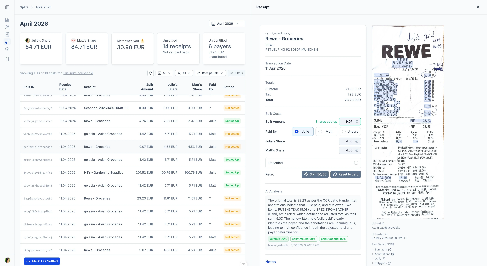

# Tally Split AI

Analyze receipts incl. handwritten annotations with AI analysis to auto-adjust totals and assign payers based on custom instructions.



#### Example Analysis

> The original total is 23.23 as per the OCR data. Handwritten annotations indicate that Julie paid, and MM owes. Two items, PUTENSTEAK (8.08) and SPEZI KROMBACHER (0.99), are circled, which defines the adjusted total as their sum: 9.07. The handwritten note 'Julie paid' clearly identifies the payer, and the annotations are unambiguous, leading to high confidence in both the adjusted total and payer determination.
> - Overall: 90%
> - splitAmount: 90%

#### Use Case

European banks are often hesitant to open bank accounts to U.S. citizens due to [FACTA](https://en.wikipedia.org/wiki/Fair_and_Accurate_Credit_Transactions_Act).

- Without a joint bank account, how can we best split shared households expenses?
- For receipts with shared and individual items, how can we indicate that some items are to be split between persons and others not?

As part of my pivot to AI Engineering and Architecture, I decided to build my own app instead of using existing commercial apps, which has added privacy benefit.

## Stack

### Application

| Component | Role |
|:--|:--|
| Nuxt | Full-stack web app (UI + API) |
| Postgres | Database for receipts, splits, and workflow state |
| Drizzle Studio | Optional UI for inspecting the database |

### Infrastructure

| Component | Role |
|:--|:--|
| Trigger.dev | Workflow (agent) orchestration |
| Azure Blob Storage | Receipt photo storage (direct client uploads via SAS) |
| Azure Document Intelligence | OCR for receipts (`prebuilt-receipt` model) |
| GPT-4o | Handwritten annotation detection |
| GPT-4o-mini | Receipt normalization & split adjustment |

## Security

Highlights of the AuthN / AuthZ design (see [`docs/SECURITY.md`](./docs/SECURITY.md) for detail):

- **Two principal types, never blended.** Human users authenticate via session (GitHub OAuth); Trigger.dev tasks authenticate via HMAC. The auth pipeline commits to one path based on request headers — a failed task token does not fall back to session auth.
- **Action-scoped HMAC tokens.** Each task gets only the `resource:permission` pairs it needs (e.g. `split:write`, `upload:read`). Tasks cannot mint their own tokens; only registered orchestrators can, and only for their declared children.
- **Cryptographic scope binding.** The token's scope is part of the signed HMAC payload, not a separate header — tampering invalidates the token. Verification uses `crypto.timingSafeEqual` and enforces a server-side expiry window.
- **Household isolation at the query layer.** Every resource read filters by the caller's household; resource-by-id reads go through a `requireAuthorization` guard that returns 404 (not 403) on mismatch to avoid leaking existence.
- **Sessions hold identity + authZ scope only.** Domain data lives in Pinia stores / DB queries, not in the session.
- **PII boundary at trigger tasks.** Tasks never see household member identities; payer initials → userId resolution happens server-side inside the API.

### Local Development

Note: offline development is not possible due to Azure, LLM, and Trigger.dev dependencies.

#### Postgres

```bash
docker compose up -f docker-compose.dev.yaml -d
```

#### Nuxt App

Load the `.env` configuration and start the app.

```bash
. ./.env
npm run dev
```
Open http://localhost:3000/

#### Trigger.dev

Connect to trigger.dev (orchestrator) to use local machine as a worker/agent.

```
npm run trigger:dev
```

#### Drizzle Studio (optional)

Drizzle provides a UI to explore database

```bash
npm run db:studio
```

Open https://local.drizzle.studio/

---

## Docs

_As of April 2025, docs are scattered brain dumps. Clean up needed._

| Path | Target Audience |
|:--|:--|
| [`ARCHITECTURE.md`](./ARCHITECTURE.md) | High-level system architecture |
| [`docs/`](./docs) | for Human understanding and reference |
| [`docs/SECURITY.md`](./docs/SECURITY.md) | Security model |
| [`trigger/README.md`](./trigger/README.md) | Trigger.dev tasks — how to run and trigger them |
| [`shared/enums/README.md`](./shared/enums/README.md) | Enum conventions |
| [`.claude/rules/`](./.claude/rules) | Instructions for agent (always loaded) |
| [`.claude/skills/`](./.claude/skills) | Loaded on Demand |
| [`CLAUDE.md`](./CLAUDE.md) | General agent instructions |

## Features

#### Frontend UI

- [x] UI to upload files (drag-and-drop, queued, direct-to-Azure)
- [x] UI to view/edit/delete receipts
- [x] UI for splits (via receipt view page)
- [x] ~~Receipt inbox view (list + preview at `/receipts/inbox`)~~ _(temporary solution removed)_
- [x] Real-time workflow status updates via SSE
- [x] SSO with GitHub

#### Backend Functionality

- [x] Blob SAS tokens on-demand
- [x] Document Intelligence API — OCR via Blob URL + SAS token
- [x] Pino structured logging with domain-based child loggers
- [x] Field-level change history for receipts and splits (human + agent mutations)

#### Annotation Functionality

- [x] Deploy GPT-4o model for analyzing images for handwritten annotations
- [x] Send API request with 1) OCR JSON and 2) Blob URL
- [x] Process response, e.g. probability

#### Workflow Orchestration

- [x] Trigger.dev orchestrator: OCR → annotations → split creation → adjust split
- [x] Per-step progress tracking in `workflow_runs` table
- [x] HMAC-authenticated HTTP API for tasks (no direct DB access)
- [x] Action-scoped tokens — minimum permissions per child task
