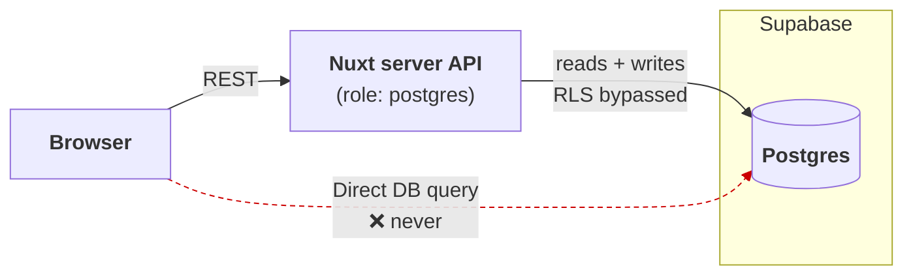
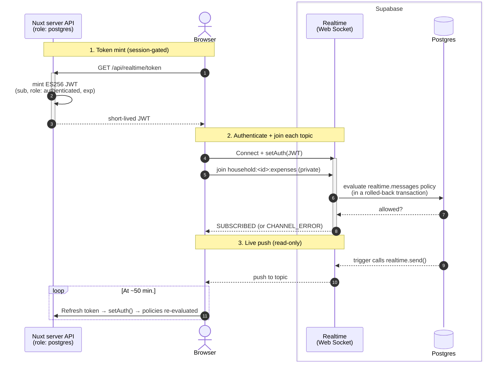

# Supabase Realtime — Security Design

- Previous setup: Server Side Events (SSE) – long-lived connections not compatible with serverless function timeouts
- Interim setup: [`postgres_changes`](https://supabase.com/docs/guides/realtime/postgres-changes) – table-level subscriptions, RLS-enforced per row
- **Current setup: [Broadcast from the database](https://supabase.com/docs/guides/realtime/broadcast#trigger-broadcast-messages-from-your-database)** – Postgres triggers build the payload and publish to a topic; authorization is the topic join

## Summary

- User authenticates with Nuxt API
- Nuxt API mints JWT (`sub`, `role: authenticated`, `exp`) signed with a _Supabase-issued_ **ES256** JWT signing key
- User joins one topic per resource — `household:<householdId>:<resource>`
- A Postgres trigger on each table calls `realtime.send()`; Supabase pushes to the topic
- Security
  - AuthN: via app
  - AuthZ: via an RLS policy on `realtime.messages` that matches the joined topic against the user's `household_id`; not a JWT claim, because that would require re-minting if the household changed

### Why Broadcast instead of `postgres_changes`

| | `postgres_changes` | Broadcast |
|:--|:--|:--|
| Payload | the **whole row**, always | exactly the columns the trigger builds |
| Table exposure | `authenticated` needs `GRANT SELECT` + an RLS policy **per table** | **no grant, no table policy** — tables stay closed to the browser |
| Publication | table must join `supabase_realtime` | not required |
| Authorization | every row, per event | the topic join, once |

- **Why:** `uploads` carries `ocr_json` (100s of KB) and `postgres_changes` can't subscribe to a column subset.
- **Bonus:** less exposure — the browser role can no longer read the tables at all.
- **Trade:** payload shape now lives in SQL, so adding a field to a surface can mean a migration.

## Connections to Supabase

| Path | Auth | Actions | RLS Enforced |
|:--|:--|:--|:--|
| Nuxt API | DB password | read + write | false |
| Browser (Realtime) | JWT | read-only | true |

### REST path

- The server connects as `postgres`, which **bypasses RLS**
- Authorization is enforced in the API handlers (session + household scoping), not the database



### Web Sockets Path



## Authorization: why you can't listen to another household

The client picks its own topic string:

```js
useRealtimeStore().subscribe(
  `household:${householdId}:workflow_runs`,
  ingestRun,
)
```

Nothing stops a user editing that to another household's id. **The topic string is a request, not a grant.** What makes it safe:

### When authorization happens

**At each topic join (`phx_join`) — not at socket connect, and not per message.**

1. The browser opens **one** websocket and calls `setAuth(JWT)`
2. For **every** `channel(topic).subscribe()`, Realtime sends a join for that topic
3. On each join, Realtime evaluates the `realtime.messages` RLS policy — running a query it then **rolls back**, so nothing is written — with `realtime.topic()` bound to the requested string
4. Allowed → `SUBSCRIBED`. Refused → the join is **rejected**, and the SDK surfaces `CHANNEL_ERROR`

A forged topic fails at step 4 — the user never joins, so no message is ever delivered.

> Being authenticated is not sufficient: the JWT proves *who* you are, the policy decides *which topics* that identity may join.

The policy ([`0022`](./../server/db/migrations/postgres/0022_add_realtime_broadcast_policy.sql)) resolves the household from the database, never from the request:

```sql
create policy "authenticated receives own household broadcasts"
on realtime.messages for select to authenticated
using (
  realtime.messages.extension = 'broadcast'
  and (select realtime.topic()) like 'household:' || (
    select household_id from public.users
    where id = (select auth.jwt() ->> 'sub')
  ) || ':%'
);
```

The `like` compares the **requested** topic against the household looked up by the token's `sub`. A topic naming any other household can't match — the client supplies the string, the database supplies the truth.

> [!IMPORTANT]
> **Policies are cached for the connection's lifetime.** Once a topic is joined, every message on it is delivered with **no further checks** — unlike `postgres_changes`, which filters every row.
>
> Two consequences:
> - **The trigger's topic string is the entire boundary.** Build it from the row's own `household_id` (`NOT NULL`, write-once) — never via a join, never from user input. A trigger that builds the wrong topic leaks across households and no per-row check will catch it.
> - The cache is re-evaluated when a **new JWT** arrives via `setAuth()` — which the token refresh does every ~50 minutes.

> [!NOTE]
> `SELECT` on `realtime.messages` is what permits **receiving**. We never add an INSERT policy: broadcasts originate in Postgres triggers, and an INSERT policy would let clients publish to each other.

### One topic per resource

- `household:<id>:expenses`
- `household:<id>:receipts`
- `household:<id>:uploads`
- `household:<id>:workflow_runs`

Per-resource, not one topic per household:

- **The subscription IS the routing** — each store receives only its own messages. No dispatcher, no event→store map.
- One prefix-matching policy covers them all.

Per-row topics (`expense:<id>`) were rejected — the client would need the id *before the row exists*, which fails the INSERT case that matters most.

#### Key files

- `server/api/realtime/token.get.js` — mints the JWT (session-gated)
- `server/utils/realtime/mint-realtime-token.js` — signing logic (+ tests)
- `app/stores/realtime.store.js` — connection + generic `subscribe(topic, handler)`; imports **no** other store
- `app/layouts/default.vue` — registers each store's subscription after `connect()`

## Payload rules

Each table's trigger builds its own payload. Three tiers:

| Tier | Mechanism | Examples |
|:--|:--|:--|
| Cheap scalars | broadcast on any INSERT/UPDATE | status, title, total, shares, `receipt_id` |
| Small, needed by a high-level surface | *optional* `AFTER UPDATE OF <col>` trigger, its own event name | `annotations_json` |
| Large, or only a leaf renders it | **never broadcast** — the owning store fetches on demand | `ocr_json`, polygons, the image |

"Optional" is load-bearing — the default is *don't broadcast*. Broadcasting a JSON column on **every** row write is the expensive thing; a column-scoped trigger is justified per field.

> [!NOTE]
> `AFTER UPDATE OF <col>` fires when the column appears in the `SET` list — **not** when its value actually changes (`SET x = x` still fires). Fine for our tasks, which issue targeted single-column writes, but it is not a change-detector.

### How the client can still drift

A payload is a **snapshot, not a diff**:

- `NEW` is the whole post-write row, so every listed scalar arrives at its current value.
- `NULL`s are sent as `null`, not omitted — so `null` means "null in the DB", safe to merge over.

Three gaps:

1. **A column not in the payload never pushes** — the UI silently renders a stale value.
2. **Relations are never in a payload** (a row trigger can't join) — so every ingest **merges**, never replaces.
3. **DELETE doesn't fire** — a row deleted in the other member's session won't disappear.

> [!TIP]
> **Bulk-fetch at the page, read by id at the cell.**
>
> - Page loads each store once (`fetchUploads()`, `fetchReceipts()`).
> - Cells resolve related resources by id from the owning store — never N per-row fetches.
> - Endpoints return `receiptId`, **not** an embedded `receipt`: fetched and pushed rows must have the same shape, or a live-created row renders blank forever.

## Configuration

### Environment Variables

See supabase docs for details:

- [Get API Details](https://supabase.com/docs/guides/realtime/getting_started#get-api-details)
  - For Realtime, use [Dashboard > Settings > API Keys](https://supabase.com/dashboard/project/_/settings/api-keys/).
  - Or go to `https://supabase.com/dashboard/project/<project_id>/settings/jwt`
  - Do _not_ use Connect Dialog (for database).
- [Understanding API keys](https://supabase.com/docs/guides/getting-started/api-keys)

| Variable | Example |
|:--|:--|
| `NUXT_PUBLIC_SUPABASE_URL` | `https://<project_id>.supabase.co` |
| `NUXT_PUBLIC_SUPABASE_PUBLISHABLE_KEY` | `sb_publishable_…` |
| `NUXT_SUPABASE_JWT_PRIVATE_KEY` | See example below |

The Supabase-issued signing key should be in this format

```json
{
  "kty": "EC",
  "kid": "UUID",
  "use": "sig",
  "key_ops": ["sign", "verify"], /* see important note below */
  "alg": "ES256",
  "ext": true,
  "d": "…",
  "crv": "P-256",
  "x": "…",
  "y": "…"
}
```

> [!WARNING]
> The [jose](https://www.npmjs.com/package/jose) webapi build **rejects** a JWK with `key_ops: ["sign","verify"]`. **Manually** remove `key_ops` before saving to `NUXT_SUPABASE_JWT_PRIVATE_KEY`

## Migrations

Policies and triggers are **hand-written SQL**, applied with `drizzle-kit migrate` like any other migration so they're tracked in history.

| Migration | What |
|:--|:--|
| `0022` | `realtime.messages` SELECT policy — the whole authorization boundary |
| `0023` | `expenses` broadcast trigger |
| `0024` | `receipts` broadcast trigger |
| `0025` | `uploads` scalars trigger + `AFTER UPDATE OF annotations_json` |
| `0026` | `workflow_runs` trigger; **tears down** the old `postgres_changes` grant, policy and publication membership |

> [!NOTE]
> Use `auth.jwt() ->> 'sub'` (text), **not** `auth.uid()`.
> `auth.uid()` casts the claim to `uuid`; our user ids are text nanoids, so it would throw and the client would be denied.

Trigger functions use `SECURITY DEFINER` with `SET search_path = ''` — hardening against schema-shadowing (CVE-2018-1058), where an unqualified name could resolve to an attacker's object and run as the function's owner. Every reference inside is therefore schema-qualified.
