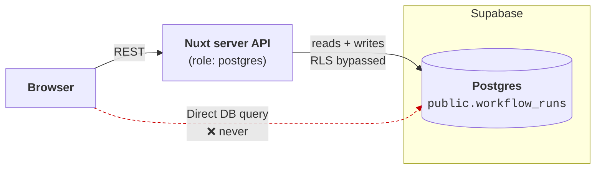
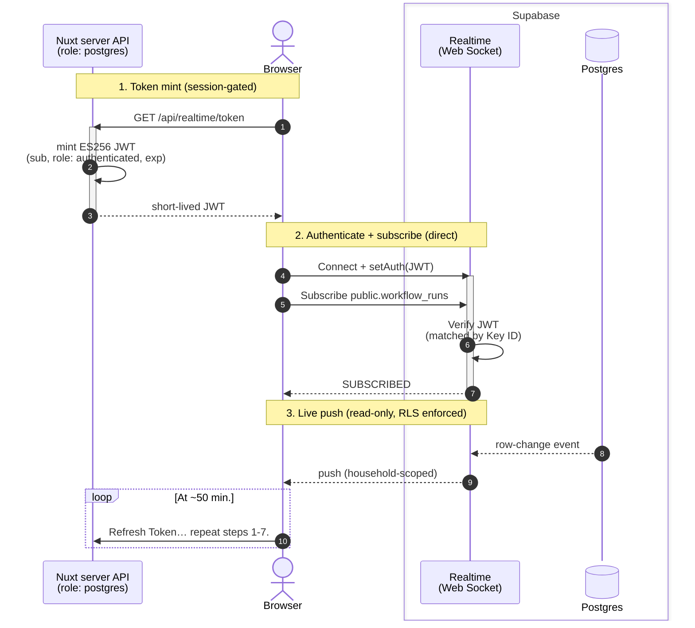

# Realtime (Supabase) — setup & how it works

- Previous setup: Server Side Events (SSE) – long-lived connections not compatible with serverless function timeouts
- Current setup: [Supabase Realtime](https://supabase.com/realtime) – user opens web sockets and receives events with authZ security boundary enforced via row level security (RLS).

## Summary

- User authenticates with Nuxt API
- Nuxt API mints JWT  (`sub`, `role: authenticated`, `exp`) incl. `household_id` signed wtih _Supabase-issued_  **ES256** JWT signing key.
- User subscribes to events for `workflow_runs` (table) via web sockets.
- Supbase broadcasts updates (RLS enforced)

## Connections to Supabase

Two paths to Supabase:

| Path | Auth | Actions | RLS Enforced |
|:--|:--|:--|:--|
| Nuxt API | DB password | read + write | false |
| Browser (Realtime) | JWT | read-only | true |

### REST path

- The server connects as `postgres`, which **bypasses RLS**
- Authorization (AuthZ) is enforced in the API handlers (session + household scoping), not the database.



### Web Sockets Path

- User connects directly to Supabase to receive read-only updates.
- User AuthN is at Nuxt API server, which issues `authenticated` JWT to confirm AuthN for Supabase.
- User AuthZ is enforced via RLS, scoped to `householdId`.
- Workers update their status via `PUT /api/workflows/runs/:runUuid/status`, which updates the `workflow_runs` table. Supabase pushes notification to user.



> [!IMPORTANT]
> `postgres_changes` enforces RLS + table grants for the connected role. Because we connect with a `role: authenticated` JWT, the table needs a SELECT grant AND an RLS SELECT policy for `authenticated` — otherwise Supabase sends the event with the row data stripped and `errors: ["Error 401: Unauthorized"]`.


#### Key files

- `server/api/realtime/token.get.js` — mints the JWT (session-gated)
- `server/utils/realtime/mint-realtime-token.js` — signing logic (+ tests)
- `app/stores/realtime.store.js` — the subscription (same `connect()`/`disconnect()` API as before)

## Configuration

### Environment Variables

See supabase docs for details:

- [Get API Details](https://supabase.com/docs/guides/realtime/getting_started#get-api-details)
  - For Realtime, use [Dashboard > Settings > API Keys](https://supabase.com/dashboard/project/_/settings/api-keys/). 
  - Or go to `https://supabase.com/dashboard/project/<project_id>/settings/jwt`
  - Do _not_ use Connect Dialog (for database).
- [Understanding API keys](https://supabase.com/docs/guides/getting-started/api-keys)

| Variable | Example | 
|:--|:--|
| `NUXT_PUBLIC_SUPABASE_URL` | `https://<project_id>.supabase.co` |
| `NUXT_PUBLIC_SUPABASE_PUBLISHABLE_KEY` | `sb_publishable_…` | 
| `NUXT_SUPABASE_JWT_PRIVATE_KEY` |  See example below |

The Supabase-issed signing key should be in this format

```json
{
  "kty": "EC",
  "kid": "UUID",
  "use": "sig",
  "key_ops": ["sign", "verify"], /* see important note below */
  "alg": "ES256",
  "ext": true,
  "d": "…",
  "crv": "P-256",
  "x": "…",
  "y": "…"
}
```

> [!WARNING]
> The [jose](https://www.npmjs.com/package/jose) webapi build **rejects** a JWK with `key_ops: ["sign","verify"]`. **Manually** remove `key_ops` before saving to `NUXT_SUPABASE_JWT_PRIVATE_KEY`

### SQL to enable publication

```sql
alter publication supabase_realtime add table workflow_runs;
```

> [!TIP]
> A `DROP SCHEMA public CASCADE` (schema reset) silently removes the table from the publication — re-run this after any reset. Verify with: `SELECT * FROM pg_publication_tables WHERE pubname='supabase_realtime';`

Authorize the `authenticated` role for postgres_changes (per DB — dev + prod)
`postgres_changes` enforces table grants + RLS for the connected role. Without this, events arrive with the row data stripped and `errors: ["Error 401: Unauthorized"]`.

```sql
-- Grant: let the authenticated role read the table
grant select on public.workflow_runs to authenticated;

-- RLS: enable + an interim SELECT policy (any authenticated user reads any row;
-- the client-side household filter narrows it). Tighten to household-scoped in
-- the Plan-2 RLS phase.
alter table public.workflow_runs enable row level security;
create policy "authenticated can read workflow_runs"
on public.workflow_runs for select to authenticated using (true);
```

Also survives a schema reset only if re-run — a `DROP SCHEMA public CASCADE` drops the policy AND the grant. 

Re-run steps 5 + 6 together after any reset (of what?? DB?)
