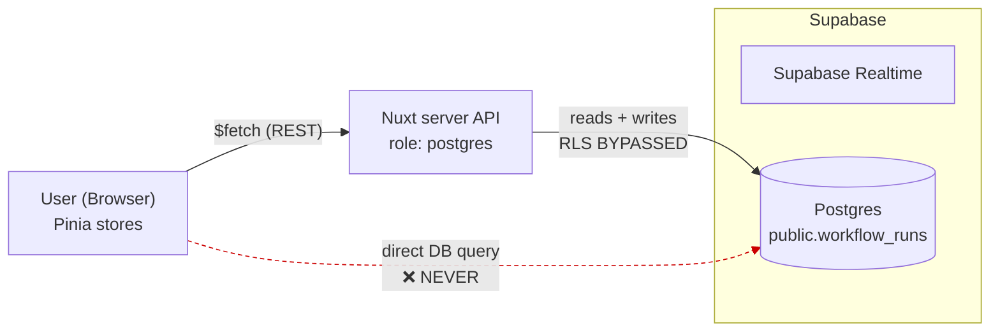
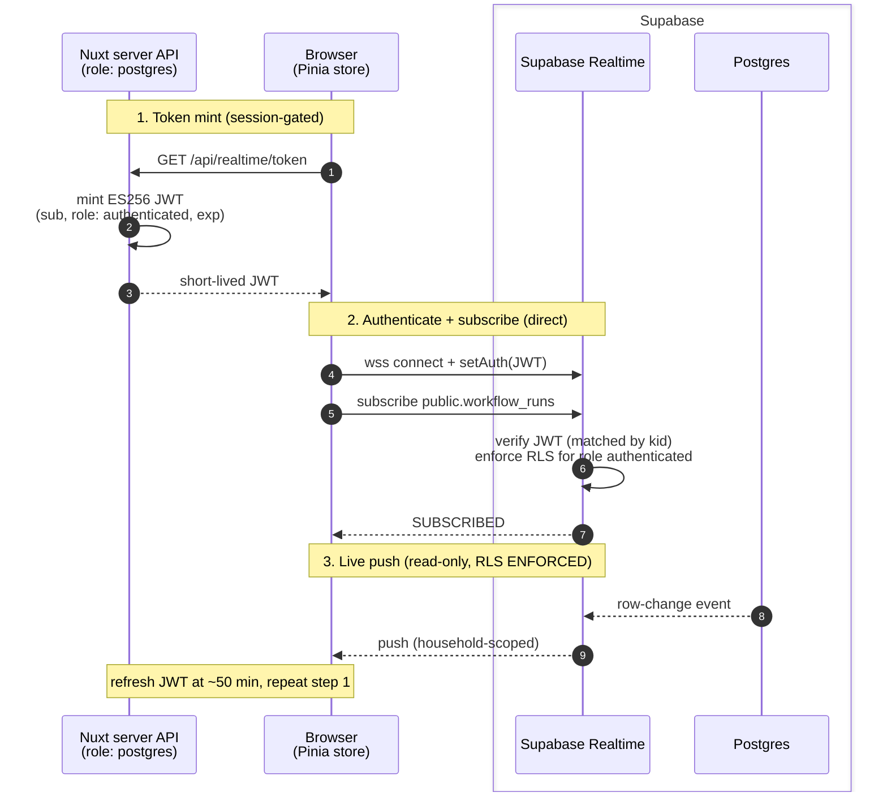

# Realtime (Supabase) — setup & how it works

Live workflow-status updates come from **Supabase Realtime** (websockets), which
broadcasts `workflow_runs` row changes directly to the browser. This replaced the
old SSE mechanism (Vercel function timeouts made SSE unworkable even on Pro).

## Connection paths (target design)

Two — and only two — paths reach Postgres:

1. **REST (reads + writes).** All RESTful DB access goes through our Nuxt APIs.
   The browser never touches Postgres directly.
2. **Realtime (read-only push).** The browser's only direct Supabase link is the
   Realtime channel, which pushes `workflow_runs` row changes to the browser.

### Diagram 1 — REST path (all reads + writes)

Every read and write goes through our Nuxt server API. The browser never queries
Postgres directly.



The server connects as `postgres`, which **bypasses RLS** — authorization is
enforced in the API handlers (session + household scoping), not the database.

### Diagram 2 — Realtime handshake (direct browser ↔ Supabase)

The one place the browser talks to Supabase directly. Our server never proxies the
websocket; it only mints the short-lived JWT that lets the browser authenticate as
`authenticated`, under which Supabase **enforces RLS**.



> **Target design.** Today the RLS policy is interim `using (true)` and the browser
> narrows to its household client-side (see step 6 + "Still TODO"). Diagram 2 shows
> the end state: household-scoped RLS enforces the boundary in the DB and the
> client-side filter is removed.

## How it works

1. Every trigger task, when a step transitions, writes the new status to
   `workflow_runs` (via `PUT /api/workflows/runs/:runUuid/status`).
2. Supabase Realtime broadcasts that row change to subscribed browsers.
3. The browser holds a subscription to `public.workflow_runs` and filters
   client-side by the current household (`workflow_runs.household_id`).
   IMPORTANT: `postgres_changes` enforces RLS + table grants for the connected
   role. Because we connect with a `role: authenticated` JWT, the table needs a
   SELECT grant AND an RLS SELECT policy for `authenticated` — otherwise Supabase
   sends the event with the row data stripped and `errors: ["Error 401:
   Unauthorized"]`. Our interim policy is `using (true)` (any authenticated user
   reads any row); the client-side household filter narrows it. Tightening that
   policy to household-scoped is the real Plan-2 RLS work (needs the household in
   the JWT). See step 6.
4. Auth: we keep our own auth in nuxt-auth-utils. `GET /api/realtime/token`
   mints a short-lived **ES256** JWT (`sub`, `role: authenticated`, `exp`),
   signed with an ES256 signing key (a JWK). The **same** signing key is imported
   into the Supabase project's JWT signing keys, so Supabase can verify our
   tokens (matched by the JWK's `kid`). The store calls
   `supabase.realtime.setAuth(token)` and refreshes at ~50 min.

Key files:
- `server/api/realtime/token.get.js` — mints the JWT (session-gated)
- `server/utils/realtime/mint-realtime-token.js` — signing logic (+ tests)
- `app/stores/realtime.store.js` — the subscription (same `connect()`/`disconnect()` API as before)

## One-time setup (do this to make it work)

### 1. Install the new deps
```
npm install
```
(adds `@supabase/supabase-js` + `jose`; also runs `nuxt prepare`, which clears the
`realtimeUtils is not defined` ESLint false-positive.)

### 2. Generate an ES256 signing key (JWK)
Use the Supabase CLI — it emits the key in JWK format (with a `kid`), which is
exactly what both Supabase's import dialog and our minter expect.
```
supabase gen signing-key --algorithm ES256
```
This prints a JWK JSON object, e.g.:
```json
{ "kty": "EC", "kid": "3a18cfe2-...", "d": "…", "crv": "P-256", "x": "…", "y": "…" }
```
The `d` field is the private part — treat the whole thing as a secret.

> The SAME JWK is used in two places: imported into Supabase (so it can verify)
> AND stored in our env (so we can sign). Supabase will NOT let you extract the
> key after import, so keep your own copy now.

### 3. Import the key into Supabase
Supabase dashboard → Project → **Settings → JWT Keys → JWT Signing Keys** →
**Create Standby Key** → algorithm **ES256 (ECC)** → check **Import an existing
private key** → paste the JWK from step 2 → **Create standby key**. Once it shows
up, promote/rotate it to the current key per the dashboard.

> This is the signing-keys "import your own key" path (Supabase docs:
> `guides/auth/signing-keys` → "How to create (mint) JWTs…"). NOT the
> third-party-auth OIDC path.

### 4. Set env vars (1Password, per environment)
Names use the Nuxt convention — `NUXT_` (server) / `NUXT_PUBLIC_` (client) prefixes
auto-map onto `runtimeConfig` at runtime; no `process.env` wiring in the config.

| Var | Value | Notes |
|:--|:--|:--|
| `NUXT_PUBLIC_SUPABASE_URL` | project URL | client-safe |
| `NUXT_PUBLIC_SUPABASE_PUBLISHABLE_KEY` | publishable key (`sb_publishable_…`) | client-safe; Settings → API Keys → Publishable key (replaces legacy anon key) |
| `NUXT_SUPABASE_JWT_PRIVATE_KEY` | the full JWK JSON string from step 2 | server-only; includes its own `kid` (no separate kid var) |

### 5. Enable the Realtime publication (per DB — dev + prod)
```sql
alter publication supabase_realtime add table workflow_runs;
```
> GOTCHA: a `DROP SCHEMA public CASCADE` (schema reset) silently removes the table
> from the publication — re-run this after any reset. Verify with:
> `SELECT * FROM pg_publication_tables WHERE pubname='supabase_realtime';`

### 6. Authorize the `authenticated` role for postgres_changes (per DB — dev + prod)
`postgres_changes` enforces table grants + RLS for the connected role. Without
this, events arrive with the row data stripped and `errors: ["Error 401:
Unauthorized"]`.
```sql
-- Grant: let the authenticated role read the table
grant select on public.workflow_runs to authenticated;

-- RLS: enable + an interim SELECT policy (any authenticated user reads any row;
-- the client-side household filter narrows it). Tighten to household-scoped in
-- the Plan-2 RLS phase.
alter table public.workflow_runs enable row level security;
create policy "authenticated can read workflow_runs"
on public.workflow_runs for select to authenticated using (true);
```
> Also survives a schema reset only if re-run — a `DROP SCHEMA public CASCADE`
> drops the policy AND the grant. Re-run steps 5 + 6 together after any reset.

## Test end-to-end

- Unit test (passing): `npx vitest run server/utils/realtime/mint-realtime-token.test.js`
- Manual: open `/uploads`, wait for `[RealtimeStore] subscribed` in the console,
  THEN upload a receipt (subscribing after a run finishes means no live events to
  see). Watch the workflow steps update live without a refresh.
- Troubleshooting when subscribed but nothing updates:
  - Empty `payload.new` + `errors: ["Error 401: Unauthorized"]` → step 6 (grant/RLS)
  - No events at all during a live run → step 5 (publication), or the app is
    writing to a different DB than the browser's Supabase project
  - Events arrive but filtered out → household mismatch (`row.household_id` vs
    `useHouseholdStore().id`)

## Still TODO (flagged, not done)
- **RLS** (later phase) — tighten the interim `using (true)` policy (step 6) to
  household-scoped so the DB enforces the filter instead of the client. Then the
  client-side `household_id` check in the store can go away. Two ways to scope:
  - **Derive from `sub` (no JWT change):** the token already carries `sub` =
    our user id, readable as `auth.uid()`. Scope the policy by joining
    membership, e.g. `using (household_id in (select hm.household_id from
    household_members hm where hm.user_id = auth.uid()))`. Works with today's
    token; membership changes take effect without re-minting.
  - **Add `household_id` to the JWT:** simpler/cheaper policy (`using
    (household_id = auth.jwt()->>'household_id')`), but the token then encodes
    household — it must be re-minted when a user switches/joins a household.
  - Only `workflow_runs` RLS is load-bearing (it's the only table the browser
    subscribes to). RLS on other user-facing tables would be pure defense-in-depth
    — our REST APIs connect as `postgres` (bypasses RLS), and the browser never
    queries those tables directly. See the connection-paths diagram above.

## History
- The old SSE mechanism (an in-memory `workflowBus` + a `notifyStatus` callback
  from each trigger task to `POST /api/workflows/callback/:runUuid`) was removed.
  Live updates now come from Realtime broadcasting the `workflow_runs` DB write
  that each task already performs — the callback push was redundant.
