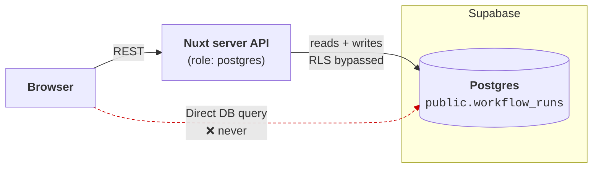
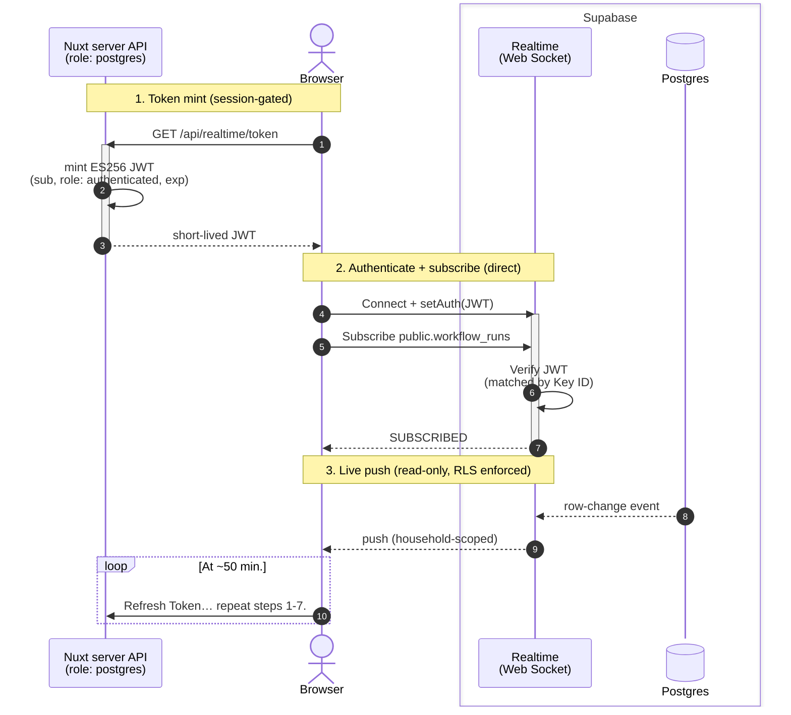

# Supabase Realtime — Security Design

- Previous setup: Server Side Events (SSE) – long-lived connections not compatible with serverless function timeouts
- Current setup: [Supabase Realtime](https://supabase.com/realtime) – user opens web sockets and receives events with authZ security boundary enforced via row level security (RLS).

## Summary

- User authenticates with Nuxt API
- Nuxt API mints JWT  (`sub`, `role: authenticated`, `exp`) signed with _Supabase-issued_  **ES256** JWT signing key. 
- User subscribes to events for `workflow_runs` (table) via web sockets.
- Supabase broadcasts updates (RLS enforced)
- Security
  - AuthN: via app
  - AuthZ: via RLS policy that scopes roles to user's `household_id`; not JWT token because it would require re-minting if household change.
  

## Connections to Supabase

Two paths to Supabase:

| Path | Auth | Actions | RLS Enforced |
|:--|:--|:--|:--|
| Nuxt API | DB password | read + write | false |
| Browser (Realtime) | JWT | read-only | true |

### REST path

- The server connects as `postgres`, which **bypasses RLS**
- Authorization (AuthZ) is enforced in the API handlers (session + household scoping), not the database.



### Web Sockets Path

- User connects directly to Supabase to receive read-only updates.
- User AuthN is at Nuxt API server, which issues `authenticated` JWT to confirm AuthN for Supabase.
- User AuthZ is enforced via RLS. The policy scopes rows to the user's household by looking up `public.users` on `auth.uid()` (the token's `sub`).
- Workers update their status via `PUT /api/workflows/runs/:runUuid/status`, which updates the `workflow_runs` table. Supabase pushes notification to user.



> [!IMPORTANT]
> `postgres_changes` enforces RLS + table grants for the connected role. Because we connect with a `role: authenticated` JWT, the table needs a SELECT grant AND an RLS SELECT policy for `authenticated`
> 
> Otherwise Supabase sends the event with the row data stripped and `errors: ["Error 401: Unauthorized"]`.


#### Key files

- `server/api/realtime/token.get.js` — mints the JWT (session-gated)
- `server/utils/realtime/mint-realtime-token.js` — signing logic (+ tests)
- `app/stores/realtime.store.js` — the subscription (same `connect()`/`disconnect()` API as before)

## Configuration

### Environment Variables

See supabase docs for details:

- [Get API Details](https://supabase.com/docs/guides/realtime/getting_started#get-api-details)
  - For Realtime, use [Dashboard > Settings > API Keys](https://supabase.com/dashboard/project/_/settings/api-keys/). 
  - Or go to `https://supabase.com/dashboard/project/<project_id>/settings/jwt`
  - Do _not_ use Connect Dialog (for database).
- [Understanding API keys](https://supabase.com/docs/guides/getting-started/api-keys)

| Variable | Example | 
|:--|:--|
| `NUXT_PUBLIC_SUPABASE_URL` | `https://<project_id>.supabase.co` |
| `NUXT_PUBLIC_SUPABASE_PUBLISHABLE_KEY` | `sb_publishable_…` | 
| `NUXT_SUPABASE_JWT_PRIVATE_KEY` |  See example below |

The Supabase-issued signing key should be in this format

```json
{
  "kty": "EC",
  "kid": "UUID",
  "use": "sig",
  "key_ops": ["sign", "verify"], /* see important note below */
  "alg": "ES256",
  "ext": true,
  "d": "…",
  "crv": "P-256",
  "x": "…",
  "y": "…"
}
```

> [!WARNING]
> The [jose](https://www.npmjs.com/package/jose) webapi build **rejects** a JWK with `key_ops: ["sign","verify"]`. **Manually** remove `key_ops` before saving to `NUXT_SUPABASE_JWT_PRIVATE_KEY`

## SQL for RLS policy & grants

Because Drizzle is an ORM, the policies are **hand-written SQL** migrations, e.g. [`0018_household_scoped_workflow_runs_rls.sql`](./../server/db/migrations/postgres/0018_household_scoped_workflow_runs_rls.sql).

> [!IMPORTANT]
> Apply policy with `drizzle-kit migrate` like any other migration, so it's tracked in history.

The policy does four things, all required for the browser's `role: authenticated` connection to receive row data.

1. **Add `workflow_runs` to the `supabase_realtime` publication** — so Realtime broadcasts its row changes at all.

2. **`GRANT SELECT` to `authenticated`** — `postgres_changes` enforces table grants for the connected role.

3. **`GRANT SELECT (id, household_id)` on `public.users` + a self-only SELECT policy** — lets the policy subquery resolve the caller's household, while exposing only the caller's own row.

  ```sql
  using ( id = (select auth.jwt() ->> 'sub') )
  ```

4. **Enable RLS + a household-scoped SELECT policy** — scopes each user to their own household. The policy reads no household claim from the token; it looks the household up from `public.users` by the JWT `sub`, so switching households needs no re-mint:
  ```sql
  using (
    household_id in (
      select household_id from public.users where id = (select auth.jwt() ->> 'sub')
    )
  )
  ```

> [!NOTE]
> Use `auth.jwt() ->> 'sub'` (text), **not** `auth.uid()`.
> `auth.uid()` casts the claim to `uuid`; our user ids are text nanoids, so it would throw and the row would be stripped.
