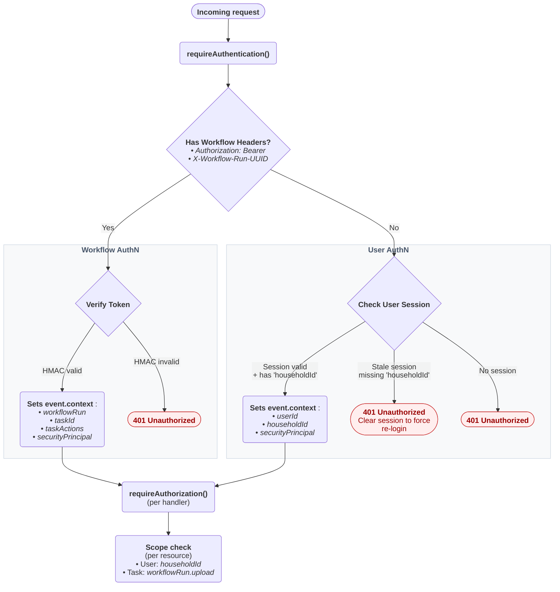
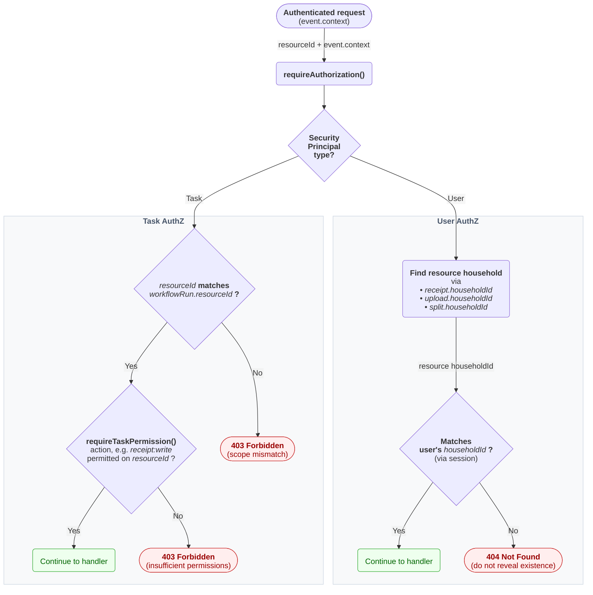
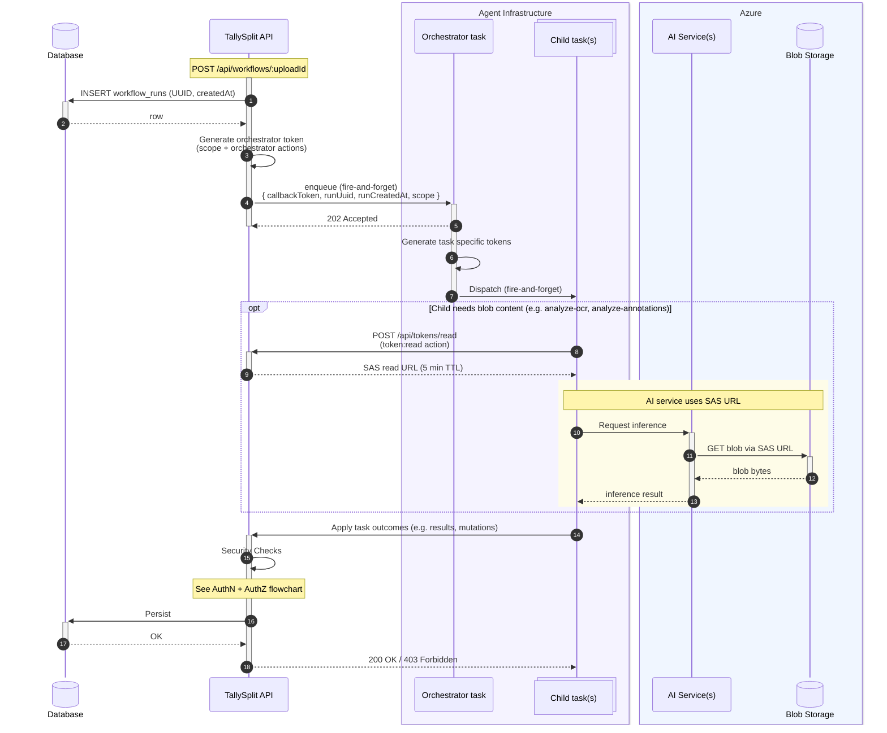

# Security Model

This document describes the authentication and authorization architecture for the application, including how human users and headless agents (Trigger.dev tasks) authenticate and what they are authorized to access.

## Principals

There are two types of principals in this system. They are always separate and never share identity or auth paths.

### Human Principals (Users)

Human users authenticate via GitHub OAuth (`nuxt-auth-utils`). The session establishes `event.context.userId` (identity) and `event.context.householdId` (authorization scope), which are used by `requireAuthorization` to enforce household-membership-based access.

User accounts are a closed set — only users explicitly added via the household member endpoint can log in. OAuth login refreshes existing user records but never creates new ones; unknown `githubId`s are redirected to `/login/unauthorized`.

### Service Principals (Tasks)

Trigger.dev tasks are headless agents that process receipts. They authenticate via action-scoped HMAC tokens — each task receives a unique token encoding its allowed permissions. A task never authenticates as a user — it authenticates as itself. The token establishes `event.context.workflowRun`, `event.context.taskId`, and `event.context.taskActions`.

Both principal types set `event.context.securityPrincipal` — a string in the format `user:<userId>` or `task:<taskId>` — used for audit trail logging (change history source).

> [!IMPORTANT]
> A task must never be granted a `userId` or act "on behalf of" a user. The principal types are analogous to Azure's user principals vs. service principals — same platform, fully separate identity types.

## Authentication (AuthN)

AuthN is handled by `requireAuthentication(event)`, which dispatches to the appropriate auth mechanism based on what credentials are present. The two paths are mutually exclusive — a single request is either user-authenticated or task-authenticated, never both. AuthZ then runs on whichever principal was established.



> [!IMPORTANT]
> If workflow headers are present but the HMAC fails, the request is rejected — it does NOT fall through to user auth. This prevents identity blending (a task pretending to be a user on failure).

### Dispatch Order

If workflow auth headers (`Authorization: Bearer` + `X-Workflow-Run-UUID`) are present, the **task path runs exclusively**. If task auth fails, the request is rejected — it does **not** fall through to user auth. This prevents identity blending (a task pretending to be a user on failure).

If no workflow headers are present, the user auth path runs.

### User Auth Path

- Reads the session via `nuxt-auth-utils` (`getUserSession`)
- Rejects sessions that lack `householdId` (stale cookies issued before Phase 1 introduced the field) — clears the session and returns 401 to force re-login
- Sets `event.context.userId`, `event.context.householdId`, and `event.context.securityPrincipal`

> [!NOTE]
> `householdId` lives in the session as an authZ **scope claim** — analogous to scopes in an OAuth JWT — not as domain data. It's stored there so authZ checks don't need a per-request DB lookup. Frontend stores must not expose `householdId` via `useUserStore`; household domain data lives in a separate store.

### Session Cookies

User sessions are sealed (encrypted + MAC'd) cookies via `nuxt-auth-utils` (which wraps `iron-webcrypto`). The session payload holds identity claims and authZ scope only — see the `toSessionUser` helper in `server/utils/`. Domain data lives in DB queries / Pinia stores.

| Attribute | Value |
|:--|:--|
| Cookie name | `tally-split-session` |
| `HttpOnly` | `true` |
| `SameSite` | `Lax` |
| `Secure` | `true` in production, `false` in dev (gated on `NODE_ENV` by `nuxt-auth-utils`) |
| `Path` | `/` |
| `maxAge` | 1 day (86400 seconds) |
| Seal algorithm | AES-256-CBC + SHA-256 (iron-webcrypto defaults) |
| Seal password | `NUXT_SESSION_PASSWORD` env var (min 32 chars; required) |
| Seal TTL | `0` — sealed token does not self-expire; relies on cookie attributes + manual logout |

> [!IMPORTANT]
> Sessions are stateless — there is no server-side session store. A stolen cookie cannot be revoked before its `maxAge` (24 hours). Logout (`/logout`) clears the cookie on the client but does not invalidate the seal. Rotating `NUXT_SESSION_PASSWORD` invalidates all outstanding sessions globally.

CSRF defense relies on `SameSite=Lax` plus the closed user set — there is no CSRF token mechanism in API endpoints. Same-origin assumption is load-bearing; do not relax `SameSite` without adding CSRF tokens.

### Workflow Auth Path

Tasks send three headers with every API request:

```
Authorization: Bearer <callbackToken>
X-Workflow-Run-UUID: <runUuid>
X-Task-Id: <taskId>
```

Verification steps:
1. Extract token, runUuid, and taskId from headers
2. Look up workflow run by UUID (joins upload and receipt records)
3. **Expiry check**: reject if `now > workflowRun.createdAt + WORKFLOW_TOKEN_EXPIRY_MINUTES`
4. **Task ID validation**: look up task's allowed actions from `TASK_PERMISSIONS` map — reject unknown task IDs
5. **HMAC verification**: recompute token from known DB values using the same scope + actions, compare with `crypto.timingSafeEqual`
6. Set `event.context.workflowRun`, `event.context.taskId`, `event.context.taskActions`, and `event.context.securityPrincipal`

If neither auth path succeeds, the request is rejected with 401.

All AuthN failures are logged to the `security` domain with IP, user-agent, method, and path.

## Authorization (AuthZ)

AuthZ is handled by `requireAuthorization(event, { uploadId?, receiptId?, splitId? })`, called after AuthN in every protected handler that operates on a specific resource.



### User AuthZ

- Verifies the resource's `householdId` matches `event.context.householdId` — i.e. the principal is a member of the household that owns the resource
- For **receipts** and **uploads**: direct column lookup (`receipts.householdId`, `uploads.householdId`)
- For **splits**: direct column lookup (`splits.householdId`) — splits carry their own write-once `householdId`, stamped at creation (inherited from the receipt when linking one, else the acting principal's household). This is what makes standalone splits (`receiptId` null) reachable
- Returns **404** on mismatch — do not reveal resource existence to non-members

> [!NOTE]
> The `userId` columns on receipts/uploads/splits are retained as `createdBy` metadata only — they are no longer used for authZ. AuthZ flows entirely through household membership.

### Task AuthZ (Resource Scope)

- Verifies the requested resource belongs to this workflow run's linked resources
- `uploadId`: must match `workflowRun.upload.id`
- `receiptId`: must match `workflowRun.upload.receiptId`. For first-time linking (no `upload.receiptId` yet), the receipt's `householdId` must match the upload's `householdId`
- `splitId`: must match the split linked to this workflow's receipt (looked up via `splits.receiptId → receipts.id`). For first-time linking, the split's own `householdId` column must match the upload's `householdId`
- Returns **403** on mismatch — tasks know their own scope, no need to hide resource existence

### Task AuthZ (Action Permissions)

After AuthN, `requireTaskPermission(event)` checks that the calling task has permission for the specific endpoint operation:

1. Derives `resource` from the route path (`/api/receipts/...` → `receipt`)
2. Derives `permission` from the HTTP method (`GET` → `read`, `POST`/`PUT` → `write`, `DELETE` → `delete`)
3. Checks `resource:permission` is in `event.context.taskActions`
4. Throws 403 if not permitted

This is a no-op for user requests (users are not subject to task permissions).

All AuthZ failures are logged to the `security` domain with the specific reason, IP, user-agent, method, and path.

### Special-case AuthZ: `token` resource

`POST /api/tokens/read` issues short-lived SAS read URLs for blobs and does not fit the standard `requireAuthorization` model — its resource is a *capability* ("read this blob"), not a household resource. The endpoint inlines its own AuthZ:

- **User principal**: blob's parent upload must be in `event.context.householdId`. Returns 404 on mismatch.
- **Task principal**: parent upload's `id` must equal `workflowRun.upload.id`, and `taskActions` must include `'token:read'`. Returns 403 on mismatch.

The standard `requireAuthorization(event, { uploadId })` is **not** suitable here because requests are keyed by `blobName`, not `uploadId` — and blobs include thumbnails, which are not the upload's primary blob.

The path-based `_deriveResource` mapping does NOT include `/api/tokens` — derivation would yield `token:write` for a POST, which is semantically wrong (generating a SAS read URL is a read-capability action). The endpoint checks `'token:read'` directly instead of going through `requireTaskPermission`.

**Why this matters operationally:** Trigger.dev workers do not need `AZURE_STORAGE_ACCOUNT_KEY` in their environment. The storage key stays server-side; workers only hold their HMAC callback token + this scoped `token:read` capability.

## HMAC Token Mechanism

### Generation

Tokens are generated server-side when a user triggers a workflow (`POST /api/workflows/:uploadId`). The orchestrator then generates per-task tokens for each child task.

```
HMAC-SHA256(
  key = WORKFLOW_CALLBACK_SECRET,
  input = "${runUuid}|${runCreatedAt}|${scope}|${sortedActions}"
)
```

- `|` (pipe) is the field separator — allows `:` in scope and action values
- `sortedActions` is the task's permissions sorted alphabetically and joined with `,`
- Both `scope` and `actions` are required — generating a token without either throws an error

The token is deterministic — same inputs always produce the same hash. This means the token is valid for retries of the same operation.

### Action-Scoped Permissions

Each task has a defined set of allowed `resource:permission` pairs in `shared/config/task-permissions.js`:

```js
TASK_PERMISSIONS = {
  'receipt-workflow': ['receipt:read', 'receipt:write', 'upload:read', 'upload:write', 'workflow:read', 'workflow:write'],
  'analyze-ocr': ['upload:read', 'upload:write', 'workflow:read', 'workflow:write', 'token:read'],
  'analyze-annotations': ['upload:read', 'upload:write', 'workflow:read', 'workflow:write', 'token:read'],
  'create-split': ['receipt:read', 'receipt:write', 'split:write', 'upload:read', 'workflow:read', 'workflow:write'],
  'normalize-receipt': ['receipt:read', 'receipt:write', 'upload:read', 'workflow:read', 'workflow:write'],
  'adjust-split': ['split:write', 'upload:read', 'workflow:read', 'workflow:write'],
}
```

The orchestrator generates a unique token per child task by including that task's actions in the HMAC input. The server reconstructs the expected actions from the `X-Task-Id` header + the permissions map. No extra headers needed.

This means `analyze-annotations` literally cannot create a split — its token won't verify against an endpoint that requires `split:write`.

> [!NOTE]
> `token:read` is granted only to `analyze-ocr` and `analyze-annotations` — the only tasks that need to fetch blob content. It permits calling `POST /api/tokens/read` to obtain a short-lived (5 min) Azure Blob Storage SAS read URL for the workflow's scoped blob. Workers do not hold the storage account key — that secret stays on the Nuxt server. See "Special-case AuthZ: `token` resource" below.

### Scope

The `scope` parameter binds the token to a specific resource. It is **required** — generating a token without a scope throws an error.

Scope format: `upload:<id>` (e.g., `upload:abc123`)

The scope is derived from the workflow run's linked upload. A token scoped to one upload cannot be used to access a different resource — the HMAC will not match.

### Properties

| Property | Value |
|:--|:--|
| Algorithm | HMAC-SHA256 |
| Output | 64-character hex string |
| Field separator | `\|` (pipe) — allows `:` in scope values |
| Scoped to | A single workflow run + resource + task actions (`runUuid + createdAt + scope + actions`) |
| Expiry | `WORKFLOW_TOKEN_EXPIRY_MINUTES` (default 15 min) from `workflowRun.createdAt` |
| Comparison | `crypto.timingSafeEqual` (prevents timing side-channel attacks) |
| Secret | `WORKFLOW_CALLBACK_SECRET` env var (server-side only) |
| Scope required | Yes — generating without scope or actions throws an error |

### Token Scoping Philosophy

Tokens must be as granular as possible. The goal is that a token **cannot be reused for anything other than a retry** of the exact same operation.

Scoping layers:
1. **Action scope**: token encodes the task's allowed `resource:permission` pairs — `requireTaskPermission` enforces this per endpoint
2. **Resource scope**: token is bound to a specific workflow run and resource (e.g., `upload:abc123`) — `requireAuthorization` verifies resource ownership
3. **Time scope**: token expires after `WORKFLOW_TOKEN_EXPIRY_MINUTES` (default 15 min)

### Token Lifecycle

A blob upload is a prerequisite — see [blob-storage-architecture.md](./blob-storage-architecture.md). The diagram below picks up at workflow trigger. The trigger itself is shown as a generic `POST /api/workflows/:uploadId` — it could be initiated by a logged-in user, a cron job, or any authenticated caller.



## Security Logging

All security events are logged via `logSecurityEvent(event, level, context, message)` to the `security` domain. Every log entry includes:

- `ip` — client IP (supports `X-Forwarded-For`)
- `userAgent` — request user-agent header
- `method` — HTTP method
- `path` — request path
- Plus caller-specific context (e.g., `runUuid`, `taskId`, `reason`)

## Static Analysis Tests

Integration tests in `tests/integration/security-boundaries.test.js` enforce:

1. **No direct DB access in trigger tasks** — no `server/db/connection`, `useDB`, or `drizzle-orm` imports in `trigger/**/*.js`
2. **No legacy auth** — no `requireUserId` calls in any API endpoint
3. **AuthZ on resource endpoints** — every `[id]` endpoint calls `requireAuthorization`
4. **Correct AuthZ parameters** — receipt endpoints pass `receiptId`, split endpoints pass `splitId`, upload endpoints pass `uploadId`
5. **Task permission enforcement** — all task-facing endpoints call `requireTaskPermission`
6. **Permissions map coverage** — every task ID found in trigger files has an entry in `TASK_PERMISSIONS`
7. **Valid action format** — all entries in `TASK_PERMISSIONS` use valid `resource:permission` format

These are regex-based and can be bypassed by commented-out code (documented in test file).

Unit tests in `shared/config/task-permissions.test.js` additionally pin the **`token:read` allowlist** — the test fails loudly if any task other than `analyze-ocr` or `analyze-annotations` is granted `token:read`.

## Environment Variables

| Variable | Purpose |
|:--|:--|
| `WORKFLOW_CALLBACK_SECRET` | Secret key for HMAC token generation/verification (required; app fails to start if missing) |
| `WORKFLOW_TOKEN_EXPIRY_MINUTES` | Token validity window (default: 15 minutes) |
| `NUXT_SESSION_PASSWORD` | Seal password for user session cookies (min 32 chars; required). Rotating this invalidates all outstanding sessions. |

## Future Improvements

- **Roles within a household**: All household members currently have equal permissions on shared resources. A `GLOBAL_ADMIN_ID` env-var escape hatch is planned for cross-household admin actions (e.g. setting another member's initials).
- **Generic workflow trigger**: Current trigger endpoint uses `[uploadId]` — won't scale for receipt-triggered or other non-upload workflows.

## Intentional Constraints

- **Two members per household**: The `splits` table's hardcoded `userOneId`/`userOneShare`/`userTwoId`/`userTwoShare` shape is by design. The product scopes to two-person households (couples, roommates) and will not be generalized to N members.

- **The household is the sole authZ boundary**: Every household-scoped resource (receipts, uploads, splits) has a write-once `householdId`, and all user-facing authZ is decided against the principal's household membership.

  AuthZ not finer-grained than `householdId`. The `userId` columns on those tables are _creator/provenance metadata only_; they never gate access.
