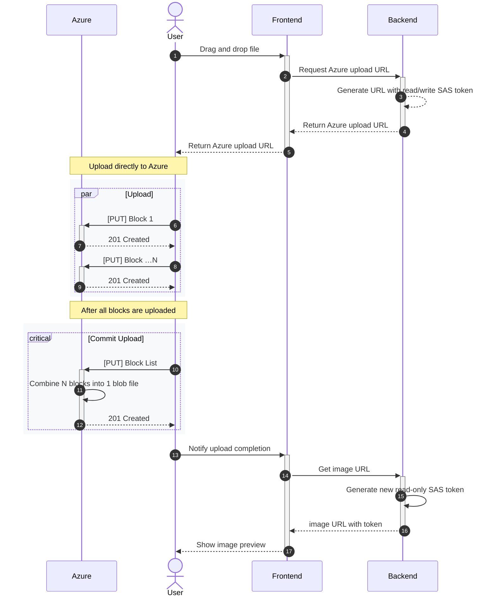

# Blob Storage Architecture

## Security Features

- Files never touch our web servers.
- Blobs are default private, i.e. inaccessible.
- SAS tokens generated on demand for action specific (e.g. upload vs read) and temporary access, e.g. a few minutes.

> [!IMPORTANT]
> Although Azure recommends _against_ using service SAS tokens, it is not appropriate in this use case. In our Software as a Service (SaaS) scenario:
> - [Workload Identities](https://learn.microsoft.com/en-us/entra/identity/managed-identities-azure-resources/overview) do not apply because end-user uploads _directly_ to Azure for performance and resiliency advantages.
> - [User delegation SAS](https://learn.microsoft.com/en-us/rest/api/storageservices/create-user-delegation-sas) do not apply because our SaaS application owns identity and access management domain and does _not_ use Entra ID as an identity provider. Additionally User SAS tokens also _cannot_ be revoked, a security disadvantage we want to avoid.
>
> Therefore, **the architecture below is the _most secure_ cloud architecture for _this_ SaaS scenario**.

## Why Upload Directly to Azure?

* **Performance** - Avoid additional hops and latency when funnelling through app backend
* **Resilience** - Leverage Azure's built-in features to handle (retry-able) blocks and committing back into single blob file

## References

- [Mozilla: 201 Status Code - Created](https://developer.mozilla.org/en-US/docs/Web/HTTP/Reference/Status/201)
- [Azure Docs: Understanding block blobs, append blobs, and page blobs](https://learn.microsoft.com/en-us/rest/api/storageservices/understanding-block-blobs--append-blobs--and-page-blobs)
- [Storage: Create a service SAS](https://learn.microsoft.com/en-us/rest/api/storageservices/create-service-sas) incl. params and permissions tables and how SAS generation works

See also [azure-apis.md](./azure-apis.md)
